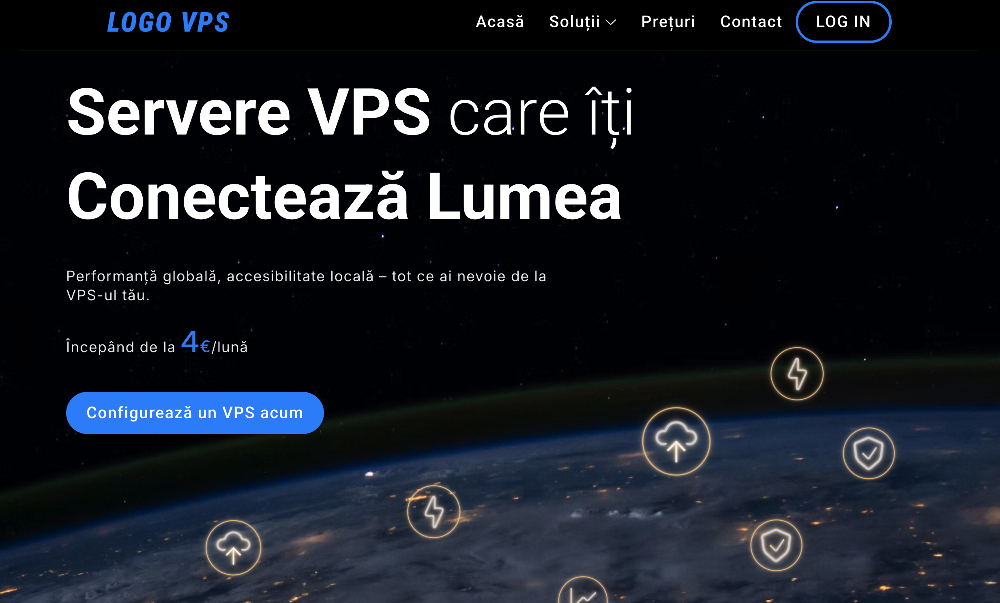
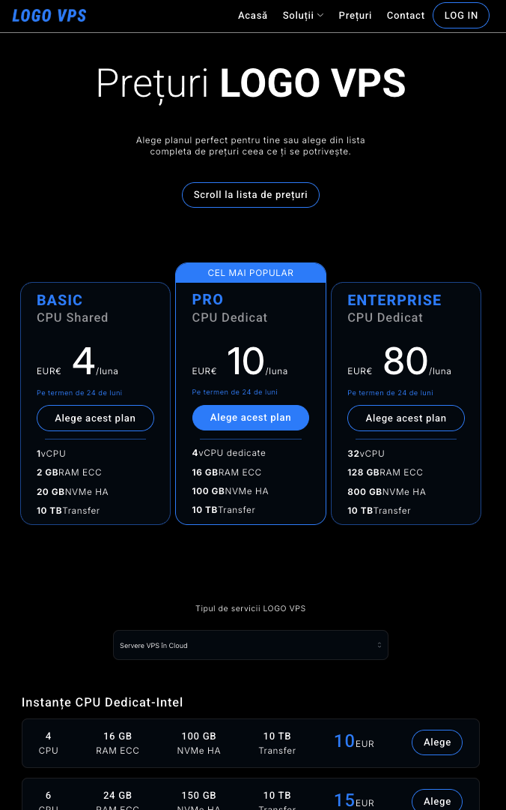
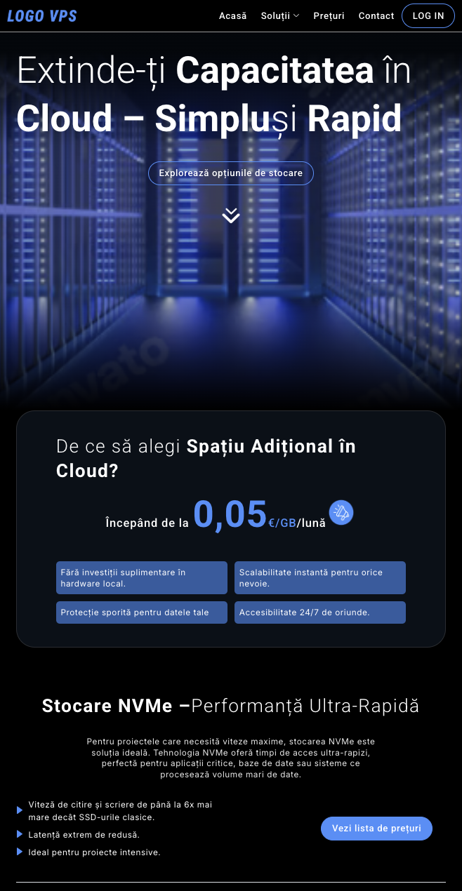

# Servere VPS



## Overview

This project is built with **TypeScript**, **Mantine UI**, and **CSS Modules** to deliver a modern and responsive UI.

## Features

- **Built with TypeScript** for type safety
- **Mantine UI** fully customizable components for an elegant interface
- **CSS Modules** for scoped styles

## Screenshots





## Installation

Clone the repo and install dependencies:

```sh
git clone https://github.com/sezginbozdemir/vps.git
cd vps
npm install
```

## Usage

Start the development server:

```sh
npm run dev
```

Then open `http://localhost:5137` in your browser.
